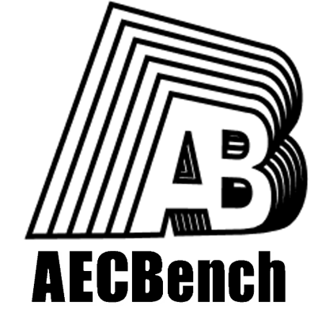
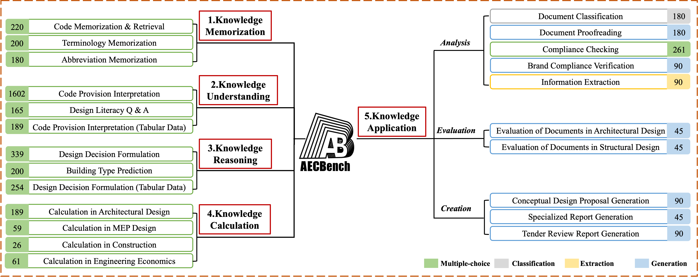

# 🏗️ AECBench 


<p align="center">
  
</p>


<div align="center">

[](https://archiai-lab.github.io/AECBench.github.io/)  [](https://arxiv.org/pdf/2509.18776)   [](https://huggingface.co/datasets/jackluoluo/AECBench)  [](README.md)
 
</div>


---

## Project Introduction

**AECBench** is an open-source large language model Architecture, Engineering & Construction (AEC) domain evaluation benchmark jointly released by East China Architectural Design & Research Institute Co., Ltd. (ECADI) of China Construction Group and Tongji University. This dataset aims to systematically evaluate large language models' (LLMs) knowledge mastery, understanding, reasoning, computation, and application capabilities in the fields of architecture, engineering, and construction. It is currently the first Chinese evaluation benchmark that covers the full AEC lifecycle with the most comprehensive cognitive hierarchy.

AECBench is based on real engineering business scenarios, designed by interdisciplinary engineer teams and validated through double-round expert review, ensuring data **authenticity, professionalism, and high quality**. Additionally, AECBench introduces an "LLM-as-a-Judge" automated evaluation mechanism to achieve scalable assessment of open-ended long-text tasks.

For more information about the project, please refer to our <a href="https://archiai-lab.github.io/AECBench.github.io/" style="text-decoration: underline;">Project Page</a>. 


## Core Advantages

• **Hierarchical Cognitive Framework**: First-ever five-level cognitive evaluation system for the AEC domain—including Knowledge Memory, Knowledge Understanding, Knowledge Reasoning, Knowledge Computation, and Knowledge Application.

• **High-Quality Dataset**: Carefully crafted by engineers based on standards, internal documents, and professional certification exam questions, containing 4,800 questions covering 23 real task types across multiple task formats including multiple choice, classification, extraction, and generation.

• **Automated Evaluation Mechanism**: Introduces "LLM-as-a-Judge" automated review mechanism, automatically evaluating open-ended tasks based on expert scoring rubrics, significantly improving evaluation consistency and scalability.

• **Real Industry Scenarios**: Questions sourced from building codes, design calculations, construction management, and equipment selection from real engineering processes, ensuring task authenticity and industry relevance.

## Dataset Content

AECBench contains **5 cognitive levels** and **23 evaluation tasks**, totaling approximately 4,800 samples. 

<div align = center>
    
</div>


<table class="tg">
<thead>
  <tr>
    <th class="tg-0pky">Cognitive Level</th>
    <th class="tg-0pky">ID</th>
    <th class="tg-0pky">Task</th>
    <th class="tg-0pky">Description</th>
    <th class="tg-0pky">Metric</th>
    <th class="tg-0pky">Type</th>
  </tr>
</thead>
<tbody>
  <tr>
    <td class="tg-lboi" rowspan="3"><b>Knowledge Memorization</b></td>
    <td class="tg-qdov">1-1</td>
    <td class="tg-qdov">Code Memorization &amp; Retrieval</td>
    <td class="tg-qdov">Given an exact code excerpt, select the originating code from four options.</td>
    <td class="tg-qdov">Accuracy</td>
    <td class="tg-qdov">Single Choice</td>
  </tr>
  <tr>
    <td class="tg-0pky">1-2</td>
    <td class="tg-qdov">Terminology Memorization</td>
    <td class="tg-qdov">Given a term definition, choose the correct terminology from four options.</td>
    <td class="tg-0pky">Accuracy</td>
    <td class="tg-0pky">Single Choice</td>
  </tr>
  <tr>
    <td class="tg-0pky">1-3</td>
    <td class="tg-qdov">Abbreviation Memorization</td>
    <td class="tg-qdov">Given an abbreviation, choose its correct expansion from four options.</td>
    <td class="tg-0pky">Accuracy</td>
    <td class="tg-0pky">Single Choice</td>
  </tr>

  <tr>
    <td class="tg-lboi" rowspan="3"><b>Knowledge Understanding</b></td>
    <td class="tg-0pky">2-1</td>
    <td class="tg-0pky">Code Provision Interpretation</td>
    <td class="tg-qdov">Given a paraphrased code description, select the option matching qualitative or quantitative requirements.</td>
    <td class="tg-0pky">Accuracy</td>
    <td class="tg-0pky">Single Choice</td>
  </tr>
  <tr>
    <td class="tg-0pky">2-2</td>
    <td class="tg-qdov">Design Literacy Q&amp;A</td>
    <td class="tg-qdov">Given an incomplete design literacy statement, infer the missing core concept and select the correct option.</td>
    <td class="tg-0pky">Accuracy</td>
    <td class="tg-0pky">Single Choice</td>
  </tr>
  <tr>
    <td class="tg-0pky">2-3</td>
    <td class="tg-qdov">Code Provision Interpretation (Tabular Data)</td>
    <td class="tg-qdov">Given a partial description of a code table, choose the option that matches the table’s requirements.</td>
    <td class="tg-0pky">Accuracy</td>
    <td class="tg-0pky">Single Choice</td>
  </tr>

  <tr>
    <td class="tg-lboi" rowspan="3"><b>Knowledge Reasoning</b></td>
    <td class="tg-0pky">3-1</td>
    <td class="tg-qdov">Design Decision Formulation</td>
    <td class="tg-qdov">Given a project scenario, select the code-compliant and logically coherent measure or decision.</td>
    <td class="tg-0pky">Accuracy</td>
    <td class="tg-0pky">Single Choice</td>
  </tr>
  <tr>
    <td class="tg-0pky">3-2</td>
    <td class="tg-qdov">Building Type Inference</td>
    <td class="tg-qdov">Given a building description, infer the building type and select the correct option.</td>
    <td class="tg-0pky">Accuracy</td>
    <td class="tg-0pky">Single Choice</td>
  </tr>
  <tr>
    <td class="tg-0pky">3-3</td>
    <td class="tg-qdov">Design Decision Formulation (Tabular Data)</td>
    <td class="tg-qdov">Same as 3-1, but the decision requires referencing code tables.</td>
    <td class="tg-0pky">Accuracy</td>
    <td class="tg-0pky">Single Choice</td>
  </tr>

  <tr>
    <td class="tg-lboi" rowspan="4"><b>Knowledge Calculation</b></td>
    <td class="tg-0pky">4-1</td>
    <td class="tg-qdov">Calculation in Architectural Design</td>
    <td class="tg-qdov">Solve quantitative architectural/structural problems and select the correct result.</td>
    <td class="tg-0pky">Accuracy</td>
    <td class="tg-0pky">Single Choice</td>
  </tr>
  <tr>
    <td class="tg-0pky">4-2</td>
    <td class="tg-qdov">Calculation in MEP Design</td>
    <td class="tg-qdov">MEP calculation tasks (e.g., airflow rate), select the correct result.</td>
    <td class="tg-0pky">Accuracy</td>
    <td class="tg-0pky">Single Choice</td>
  </tr>
  <tr>
    <td class="tg-0pky">4-3</td>
    <td class="tg-qdov">Calculation in Construction</td>
    <td class="tg-qdov">Construction calculation tasks (e.g., duration, shifts), select the correct result.</td>
    <td class="tg-0pky">Accuracy</td>
    <td class="tg-0pky">Single Choice</td>
  </tr>
  <tr>
    <td class="tg-0pky">4-4</td>
    <td class="tg-qdov">Calculation in Engineering Economics</td>
    <td class="tg-qdov">Engineering economics calculations (e.g., interest, NPV), select the correct result.</td>
    <td class="tg-0pky">Accuracy</td>
    <td class="tg-0pky">Single Choice</td>
  </tr>

  <tr>
    <td class="tg-lboi" rowspan="10"><b>Knowledge Application</b></td>
    <td class="tg-0pky">5-1-1</td>
    <td class="tg-qdov">Document Classification</td>
    <td class="tg-qdov">Given a sentence from a domain document, assign its professional discipline category.</td>
    <td class="tg-0pky">F1</td>
    <td class="tg-0pky">Classification</td>
  </tr>
  <tr>
    <td class="tg-0pky">5-1-2</td>
    <td class="tg-qdov">Document Proofreading</td>
    <td class="tg-qdov">Correct spelling, redundancy, omission, word-order, and semantic errors into a coherent revision.</td>
    <td class="tg-0pky">F0.5</td>
    <td class="tg-0pky">Generation</td>
  </tr>
  <tr>
    <td class="tg-0pky">5-1-3</td>
    <td class="tg-qdov">Compliance Checking</td>
    <td class="tg-qdov">Analyze multi-parameter cases for compliance and select the correct violation reason if non-compliant.</td>
    <td class="tg-0pky">Accuracy</td>
    <td class="tg-0pky">Single Choice</td>
  </tr>
  <tr>
    <td class="tg-0pky">5-1-4</td>
    <td class="tg-qdov">Brand Compliance Verification</td>
    <td class="tg-qdov">Given equipment spec sheets, detect and report brand-related deviations in bids.</td>
    <td class="tg-0pky">soft-F1</td>
    <td class="tg-0pky">Extraction</td>
  </tr>
  <tr>
    <td class="tg-0pky">5-1-5</td>
    <td class="tg-qdov">Information Extraction</td>
    <td class="tg-qdov">From long documents, extract all entities matching predefined types.</td>
    <td class="tg-0pky">soft-F1</td>
    <td class="tg-0pky">Extraction</td>
  </tr>
  <tr>
    <td class="tg-0pky">5-2-1</td>
    <td class="tg-qdov">Evaluation of Documents in Architectural Design</td>
    <td class="tg-qdov">Act as a judge and score architectural proposals by rubric (accuracy, expression, readability, format).</td>
    <td class="tg-0pky">Kendall τ</td>
    <td class="tg-0pky">Generation</td>
  </tr>
  <tr>
    <td class="tg-0pky">5-2-2</td>
    <td class="tg-qdov">Evaluation of Documents in Structural Design</td>
    <td class="tg-qdov">Same as 5-2-1, but for structural design documents.</td>
    <td class="tg-0pky">Kendall τ</td>
    <td class="tg-0pky">Generation</td>
  </tr>
  <tr>
    <td class="tg-0pky">5-3-1</td>
    <td class="tg-qdov">Conceptual Design Proposal Generation</td>
    <td class="tg-qdov">Given a project brief and specs, generate a preliminary design proposal.</td>
    <td class="tg-0pky">Rubric-guided LLM-as-a-Judge</td>
    <td class="tg-0pky">Generation</td>
  </tr>
  <tr>
    <td class="tg-0pky">5-3-2</td>
    <td class="tg-qdov">Specialized Report Generation</td>
    <td class="tg-qdov">Given the project brief, generate a code-compliant structural design basis report.</td>
    <td class="tg-0pky">Rubric-guided LLM-as-a-Judge</td>
    <td class="tg-0pky">Generation</td>
  </tr>
  <tr>
    <td class="tg-0lax">5-3-3</td>
    <td class="tg-0lax">Tender Review Report Generation</td>
    <td class="tg-qdov">Identify parameter mismatches and generate a tender review report summarizing discrepancies.</td>
    <td class="tg-0lax">Rubric-guided LLM-as-a-Judge</td>
    <td class="tg-0lax">Generation</td>
  </tr>
</tbody>
</table>


## Data Format Example

```json
[
  {
    "instruction": "Please use architectural knowledge to select one correct answer from A, B, C, D, and write it between [Correct Answer] and <eoa>. For example [Correct Answer]A<eoa>. Please strictly follow this format to answer.\nPlease answer:",
    "question": "Which of the following terms is defined as: \"An entrance where the ground slope does not exceed 1:20 and no handrails are installed\"?\nA.Gradual ramp\nB.Ramp entrance\nC.Accessible passage\nD.Flat slope entrance\n\n",
    "answer": "[Correct Answer]D<eoa>"
  },
]
```

## User Guide

1. **Dataset Download**: Please visit the [AECBench Official Repository](https://github.com/ArchiAI-LAB/AECBench) to download the complete dataset.  

2. **Model Evaluation**: AECBench supports automated evaluation via [OpenCompass](https://github.com/open-compass/opencompass):  
   - After installing OpenCompass, place the `one-shot` data (located at `./data/one-shot/`）) at `{PATH_TO_OPENCOMPASS}/AECBench/one-shot/`;  
   - Copy `AECBenchData` into `{PATH_TO_OPENCOMPASS}/opencompass/configs/datasets/`;  
   - Copy `AECData.py` into `{PATH_TO_OPENCOMPASS}/opencompass/datasets/`;  
   - Add this line to `{PATH_TO_OPENCOMPASS}/opencompass/datasets/__init__.py`: `from .AECData import *`;  
   - Run the evaluation command:  
   ```bash
   python run.py --models {your-model} --datasets AECBenchData_gen
   ```

**Task enabling**: Subtasks are controlled by the `*_sets` lists in `AECBenchData_gen.py`. Only non-empty lists are evaluated. Add task names to enable full evaluation.

**Recommended directory layout (OpenCompass root)**:
```
{PATH_TO_OPENCOMPASS}/
├── AECBench/
│   └── one-shot/
│       ├── 1-1规范记忆.json
│       ├── 1-2专业术语.json
│       ├── ...
├── opencompass/
│   ├── configs/
│   │   └── datasets/
│   │       └── AECBenchData/
│   │           └── AECBenchData_gen.py
│   └── datasets/
│       ├── __init__.py   # add: from .AECData import *
│       └── AECData.py
└── run.py
```

3. **Evaluation Metrics**: We provide the evaluation metric implementation specifically designed for this dataset, which has been integrated into OpenCompass. You can find and use it in `AECData.py`.

## Evaluation Results

We evaluate nine widely used LLMs, including both open-source and proprietary models, among which QwQ-32B, DeepSeek-R1, and GPT o3-mini are specifically optimized for enhanced reasoning capabilities.


**Table: Evaluation results on AECBench (higher is better).**

| Task ID | Moonshot-v1-128k | GLM-4-Plus | Qwen-Turbo | QwQ-32B | DeepSeek-V3 | DeepSeek-R1 | GPT-4o | GPT-o3-mini | Hunyuan-TurboS |
|:------:|:-----------------:|:----------:|:----------:|:-------:|:-----------:|:-----------:|:------:|:-----------:|:--------------:|
| 1-1    | 67.27             | 73.64      | 70.45      | 69.54   | 83.64       | **87.27**   | 67.27  | 63.64       | 82.73          |
| 1-2    | 96                | 97.5       | **98.5**   | 97      | 98          | 98          | 97.5   | 95          | **98.5**       |
| 1-3    | 71.67             | 80.00      | 67.78      | 77.22   | 83.89       | **87.22**   | 78.33  | 86.11       | 75.00          |
| 2-1    | 55.24             | 67.67      | 73.41      | 67.73   | 78.34       | **84.02**   | 60.05  | 54.06       | 77.03          |
| 2-2    | 71.52             | 85.45      | 87.88      | 88.48   | 88.48       | 89.70       | 80.00  | 70.91       | **90.30**      |
| 2-3    | 43.92             | 34.92      | 43.92      | 40.74   | 52.38       | **63.49**   | 44.44  | 39.68       | 43.92          |
| 3-1    | 53.69             | 66.96      | 74.63      | 71.39   | 75.52       | **82.60**   | 60.77  | 60.47       | 74.63          |
| 3-2    | 85.00             | 85.00      | 76.00      | 83.00   | 90.00       | **91.00**   | 85.50  | 82.50       | 88.00          |
| 3-3    | 34.65             | 35.83      | 43.31      | 42.13   | 32.68       | **53.94**   | 39.76  | 42.91       | 44.49          |
| 4-1    | 35.45             | 47.62      | 41.27      | 43.92   | 57.67       | **78.84**   | 39.68  | 51.32       | 33.86          |
| 4-2    | 34.62             | 73.08      | 69.23      | 88.46   | 88.46       | **96.15**   | 65.38  | 92.31       | 41.53          |
| 4-3    | 44.26             | 81.97      | 65.57      | 83.61   | **86.89**   | 85.25       | 59.02  | 75.41       | 48.08          |
| 4-4    | 35.59             | 54.24      | 50.85      | 25.42   | 55.93       | **66.10**   | 50.85  | 44.07       | 67.21          |
| 5-1-1  | 85.28             | 85.56      | 77.22      | 76.96   | 86.94       | 87.78       | **89.72** | 87.22    | 85.00          |
| 5-1-2  | 92.23             | **93.24**  | 93.75      | 86.12   | 90.19       | 62.73       | 93.14  | 89.51       | 81.20          |
| 5-1-3  | 32.95             | 7.66       | 38.70      | 45.21   | 34.87       | **52.49**   | 42.91  | 48.66       | 45.21          |
| 5-1-4  | 26.90             | 30.38      | 28.45      | 18.80   | 30.66       | 29.73       | 31.09  | 29.95       | **37.00**      |
| 5-1-5  | **73.21**         | 64.15      | 67.35      | 44.10   | 73.10       | 70.48       | 68.43  | 69.12       | 73.10          |
| 5-2-1  | 48.4              | 47.1       | 47.4       | 38.3    | 45.2        | **53.2**    | 46.5   | 50.5        | 54.9           |
| 5-2-2  | 30.9              | 33.9       | 41.7       | 51.1    | 55.7        | **56.4**    | 34.2   | 46.6        | 49.6           |
| 5-3-1  | 19.83             | 25.67      | 24.11      | 32.67   | 36.33       | **50.28***  | 19.33  | 29.11       | 43.94          |
| 5-3-2  | 27.78             | 36.67      | 33.33      | 30.00   | 39.56       | **44.44***  | 24.22  | 15.56       | 40.00          |
| 5-3-3  | 39.44             | 49.17      | 33.61      | 52.78   | 49.17       | 51.11*      | 44.44  | **53.33**   | 42.78          |


\* Tasks 5-3-1, 5-3-2, and 5-3-3 use DeepSeek-R1 as the judge model; scores marked with `*` indicate potential evaluation bias. All metrics are normalized to 0-100 scale; Kendall's τ values are scaled by 100. Bold numbers indicate best performance per task.

## License

This project follows [CC BY-NC License](LICENSE) authorization, limited to non-commercial research use only.

## Acknowledgments

This project thanks East China Architectural Design & Research Institute Co., Ltd. of China Construction Group and Tongji University for their strong support of this project. We thank Shanghai AI Laboratory for providing the OpenCompass evaluation framework, and also thank all engineers and researchers who participated in data compilation, review, and experiments.


## 📚 Citation

```bibtex
@article{LIANG2026104314,
title = {AECBench: A hierarchical benchmark for knowledge evaluation of large language models in the AEC field},
journal = {Advanced Engineering Informatics},
volume = {71},
pages = {104314},
year = {2026},
issn = {1474-0346},
doi = {https://doi.org/10.1016/j.aei.2026.104314},
url = {https://www.sciencedirect.com/science/article/pii/S1474034626000066},
author = {Chen Liang and Zhaoqi Huang and Haofen Wang and Fu Chai and Chunying Yu and Huanhuan Wei and Zhengjie Liu and Yanpeng Li and Hongjun Wang and Ruifeng Luo and Xianzhong Zhao},
}
