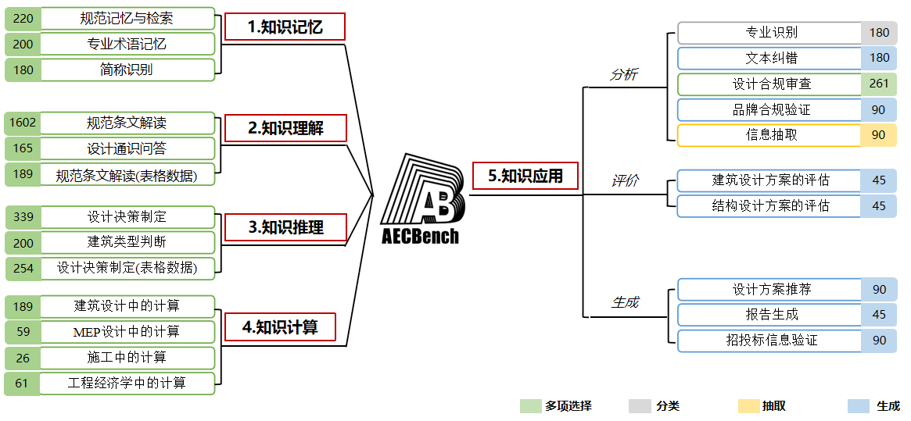
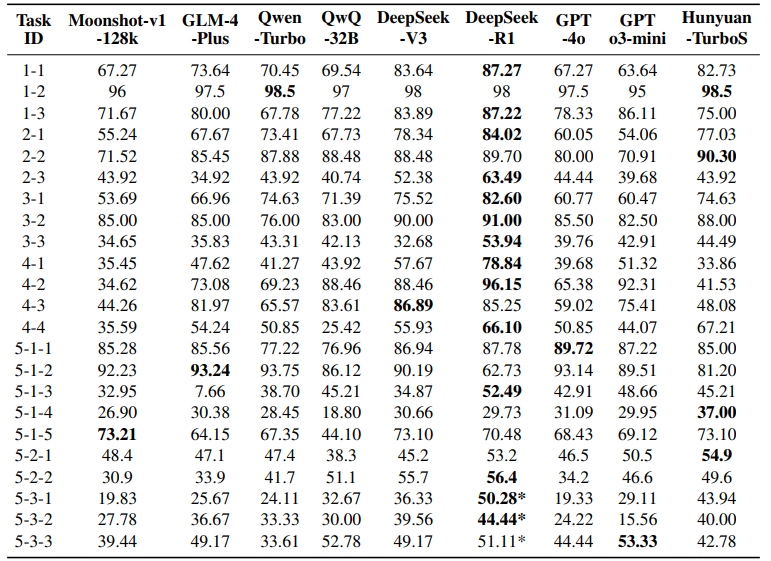

# 🏗️ AECBench 


<p align="center">
  
</p>


<div align="center">

[](https://archiai-lab.github.io/AECBench.github.io/)  [](https://arxiv.org/pdf/2509.18776)   []([huggingface-link](https://huggingface.co/datasets/jackluoluo/AECBench))  [](README.md)
 
</div>


---

## Project Introduction

**AECBench** is an open-source large language model Architecture, Engineering & Construction (AEC) domain evaluation benchmark jointly released by East China Architectural Design & Research Institute Co., Ltd. (ECADI) of China Construction Group and Tongji University. This dataset aims to systematically evaluate large language models' (LLMs) knowledge mastery, understanding, reasoning, computation, and application capabilities in the fields of architecture, engineering, and construction. It is currently the first Chinese evaluation benchmark that covers the full AEC lifecycle with the most comprehensive cognitive hierarchy.

AECBench is based on real engineering business scenarios, designed by interdisciplinary engineer teams and validated through double-round expert review, ensuring data **authenticity, professionalism, and high quality**. Additionally, AECBench introduces an "LLM-as-a-Judge" automated evaluation mechanism to achieve scalable assessment of open-ended long-text tasks.

For more information about the project, please refer to our <a href="https://archiai-lab.github.io/AECBench.github.io/" style="text-decoration: underline;">Project Page</a>. 


## Core Advantages

• **Hierarchical Cognitive Framework**: First-ever five-level cognitive evaluation system for the AEC domain—including Knowledge Memory, Knowledge Understanding, Knowledge Reasoning, Knowledge Computation, and Knowledge Application.

• **High-Quality Dataset**: Carefully crafted by engineers based on standards, internal documents, and professional certification exam questions, containing 4,800 questions covering 23 real task types across multiple task formats including multiple choice, classification, extraction, and generation.

• **Automated Evaluation Mechanism**: Introduces "LLM-as-a-Judge" automated review mechanism, automatically evaluating open-ended tasks based on expert scoring rubrics, significantly improving evaluation consistency and scalability.

• **Real Industry Scenarios**: Questions sourced from building codes, design calculations, construction management, and equipment selection from real engineering processes, ensuring task authenticity and industry relevance.

## Dataset Content

AECBench contains **5 cognitive levels** and **23 evaluation tasks**, totaling approximately 4,800 samples. 

<div align = center>
    
</div>


<table class="tg">
<thead>
  <tr>
    <th class="tg-0pky">Cognitive Level</th>
    <th class="tg-0pky">ID</th>
    <th class="tg-0pky">Task</th>
    <th class="tg-0pky">Description</th>
    <th class="tg-0pky">Metric</th>
    <th class="tg-0pky">Type</th>
  </tr>
</thead>
<tbody>
  <tr>
    <td class="tg-lboi" rowspan="3"><b>Architectural Knowledge Memory</b></td>
    <td class="tg-qdov">1-1</td>
    <td class="tg-qdov">Code Memory</td>
    <td class="tg-qdov">Identify and judge the correctness and applicability of building code provisions.</td>
    <td class="tg-qdov">Accuracy</td>
    <td class="tg-qdov">Single Choice</td>
  </tr>
  <tr>
    <td class="tg-0pky">1-2</td>
    <td class="tg-qdov">Professional Terminology</td>
    <td class="tg-qdov">Select correct terminology based on definitions.</td>
    <td class="tg-0pky">Accuracy</td>
    <td class="tg-0pky">Single Choice</td>
  </tr>
  <tr>
    <td class="tg-0pky">1-3</td>
    <td class="tg-qdov">Abbreviation Recognition</td>
    <td class="tg-qdov">Identify meanings of common AEC domain abbreviations.</td>
    <td class="tg-0pky">Accuracy</td>
    <td class="tg-0pky">Single Choice</td>
  </tr>

  <tr>
    <td class="tg-lboi" rowspan="3"><b>Knowledge Understanding</b></td>
    <td class="tg-0pky">2-1</td>
    <td class="tg-0pky">Code Provision Understanding</td>
    <td class="tg-qdov">Understand qualitative or quantitative requirements of building codes.</td>
    <td class="tg-0pky">Accuracy</td>
    <td class="tg-0pky">Single Choice</td>
  </tr>
  <tr>
    <td class="tg-0pky">2-2</td>
    <td class="tg-qdov">Design General Q&A</td>
    <td class="tg-qdov">Complete or judge fundamental architectural design knowledge.</td>
    <td class="tg-0pky">Accuracy</td>
    <td class="tg-0pky">Single Choice</td>
  </tr>
  <tr>
    <td class="tg-0pky">2-3</td>
    <td class="tg-qdov">Table Provision Understanding</td>
    <td class="tg-qdov">Understand code table content and parameter logic.</td>
    <td class="tg-0pky">Accuracy</td>
    <td class="tg-0pky">Single Choice</td>
  </tr>

  <tr>
    <td class="tg-lboi" rowspan="3"><b>Knowledge Reasoning</b></td>
    <td class="tg-0pky">3-1</td>
    <td class="tg-qdov">Design Decision Making</td>
    <td class="tg-qdov">Conduct standardized design reasoning based on scenario descriptions.</td>
    <td class="tg-0pky">Accuracy</td>
    <td class="tg-0pky">Single Choice</td>
  </tr>
  <tr>
    <td class="tg-0pky">3-2</td>
    <td class="tg-qdov">Building Type Inference</td>
    <td class="tg-qdov">Infer building types from descriptions.</td>
    <td class="tg-0pky">Accuracy</td>
    <td class="tg-0pky">Single Choice</td>
  </tr>
  <tr>
    <td class="tg-0pky">3-3</td>
    <td class="tg-qdov">Tabular Design Reasoning</td>
    <td class="tg-qdov">Conduct reasoning and judgment based on code table information.</td>
    <td class="tg-0pky">Accuracy</td>
    <td class="tg-0pky">Single Choice</td>
  </tr>

  <tr>
    <td class="tg-lboi" rowspan="4"><b>Knowledge Computation</b></td>
    <td class="tg-0pky">4-1</td>
    <td class="tg-qdov">Architectural Design Calculation</td>
    <td class="tg-qdov">Execute structural and architectural-related calculation tasks.</td>
    <td class="tg-0pky">Accuracy</td>
    <td class="tg-0pky">Single Choice</td>
  </tr>
  <tr>
    <td class="tg-0pky">4-2</td>
    <td class="tg-qdov">MEP Design Calculation</td>
    <td class="tg-qdov">Evaluate HVAC and electrical system calculation capabilities.</td>
    <td class="tg-0pky">Accuracy</td>
    <td class="tg-0pky">Single Choice</td>
  </tr>
  <tr>
    <td class="tg-0pky">4-3</td>
    <td class="tg-qdov">Construction Management Calculation</td>
    <td class="tg-qdov">Calculate construction parameters such as duration, personnel, and equipment.</td>
    <td class="tg-0pky">Accuracy</td>
    <td class="tg-0pky">Single Choice</td>
  </tr>
  <tr>
    <td class="tg-0pky">4-4</td>
    <td class="tg-qdov">Engineering Economics Calculation</td>
    <td class="tg-qdov">Conduct economic analysis including cost, interest rates, and NPV.</td>
    <td class="tg-0pky">Accuracy</td>
    <td class="tg-0pky">Single Choice</td>
  </tr>

  <tr>
    <td class="tg-lboi" rowspan="10"><b>Knowledge Application</b></td>
    <td class="tg-0pky">5-1-1</td>
    <td class="tg-qdov">Document Classification</td>
    <td class="tg-qdov">Determine professional categories of architectural documents.</td>
    <td class="tg-0pky">F1</td>
    <td class="tg-0pky">Classification</td>
  </tr>
  <tr>
    <td class="tg-0pky">5-1-2</td>
    <td class="tg-qdov">Text Proofreading</td>
    <td class="tg-qdov">Correct grammatical and semantic errors in documents.</td>
    <td class="tg-0pky">F0.5</td>
    <td class="tg-0pky">Generation</td>
  </tr>
  <tr>
    <td class="tg-0pky">5-1-3</td>
    <td class="tg-qdov">Compliance Check</td>
    <td class="tg-qdov">Verify whether design parameters comply with code requirements.</td>
    <td class="tg-0pky">Accuracy</td>
    <td class="tg-0pky">Single Choice</td>
  </tr>
  <tr>
    <td class="tg-0pky">5-1-4</td>
    <td class="tg-qdov">Brand Consistency Verification</td>
    <td class="tg-qdov">Check whether equipment specifications match brands.</td>
    <td class="tg-0pky">soft-F1</td>
    <td class="tg-0pky">Extraction</td>
  </tr>
  <tr>
    <td class="tg-0pky">5-1-5</td>
    <td class="tg-qdov">Information Extraction</td>
    <td class="tg-qdov">Extract project or bidding entity information from long texts.</td>
    <td class="tg-0pky">soft-F1</td>
    <td class="tg-0pky">Extraction</td>
  </tr>
  <tr>
    <td class="tg-0pky">5-2-1</td>
    <td class="tg-qdov">Architectural Design Report Evaluation</td>
    <td class="tg-qdov">Score architectural scheme reports based on expert rubrics.</td>
    <td class="tg-0pky">Kendall τ</td>
    <td class="tg-0pky">Generation</td>
  </tr>
  <tr>
    <td class="tg-0pky">5-2-2</td>
    <td class="tg-qdov">Structural Design Report Evaluation</td>
    <td class="tg-qdov">Score structural design reports based on rubrics.</td>
    <td class="tg-0pky">Kendall τ</td>
    <td class="tg-0pky">Generation</td>
  </tr>
  <tr>
    <td class="tg-0pky">5-3-1</td>
    <td class="tg-qdov">Conceptual Scheme Generation</td>
    <td class="tg-qdov">Generate architectural conceptual design schemes compliant with codes.</td>
    <td class="tg-0pky">Expert Score</td>
    <td class="tg-0pky">Generation</td>
  </tr>
  <tr>
    <td class="tg-0pky">5-3-2</td>
    <td class="tg-qdov">Specialized Report Generation</td>
    <td class="tg-qdov">Generate specialized design reports compliant with industry standards.</td>
    <td class="tg-0pky">Expert Score</td>
    <td class="tg-0pky">Generation</td>
  </tr>
  <tr>
    <td class="tg-0lax">5-3-3</td>
    <td class="tg-0lax">Bid Evaluation Report Generation</td>
    <td class="tg-qdov">Generate evaluation reports based on equipment specifications and parameters.</td>
    <td class="tg-0lax">Expert Score</td>
    <td class="tg-0lax">Generation</td>
  </tr>
</tbody>
</table>


## Data Format Example

```json
[
  {
    "instruction": "Please use architectural knowledge to select one correct answer from A, B, C, D, and write it between [Correct Answer] and <eoa>. For example [Correct Answer]A<eoa>. Please strictly follow this format to answer.\nPlease answer:",
    "question": "Which of the following terms is defined as: \"An entrance where the ground slope does not exceed 1:20 and no handrails are installed\"?\nA.Gradual ramp\nB.Ramp entrance\nC.Accessible passage\nD.Flat slope entrance\n\n",
    "answer": "[Correct Answer]D<eoa>"
  },
]
```

## User Guide

1. **Dataset Download**: Please visit the [AECBench Official Repository](https://github.com/ArchiAI-LAB/AECBench) to download the complete dataset.  

2. **Model Evaluation**: AECBench supports automated evaluation processes based on [OpenCompass](https://github.com/open-compass/opencompass):  
   - Place the `data` folder in `{PATH_TO_OPENCOMPASS}/AECBench/`;  
   - Place the `AECBenchData` forder in `/OpenCompass/configs/datasets/AECBenchData`;  
   - Place `AECData.py` in `/OpenCompass/opencompass/datasets/AECData.py`;  
   - Run the following command for evaluation:  
   ```bash
   python run.py --models {your-model} --datasets AECBenchData_gen
   ```

3. **Evaluation Metrics**: We provide the evaluation metric implementation specifically designed for this dataset, which has been integrated into OpenCompass. You can find and use it in `AECData.py`.

## Evaluation Results

We tested multiple open-source and commercial models (DeepSeek-R1, GPT-4o, Qwen, GLM-4, etc.). 

<div align = center>
    
</div>

## License

This project follows [CC BY-NC License](LICENSE) authorization, limited to non-commercial research use only.

## Acknowledgments

This project thanks East China Architectural Design & Research Institute Co., Ltd. of China Construction Group and Tongji University for their strong support of this project. We thank Shanghai AI Laboratory for providing the OpenCompass evaluation framework, and also thank all engineers and researchers who participated in data compilation, review, and experiments.


## 📚 Citation

```bibtex
@article{liang2025aecbench,
  title={AECBench: A Hierarchical Benchmark for Knowledge Evaluation of Large Language Models in the AEC Field},
  author={Chen Liang and Zhaoqi Huang and Haofen Wang and Fu Chai and Chunying Yu and Huanhuan Wei and Zhengjie Liu and Yanpeng Li and Hongjun Wang and Ruifeng Luo and Xianzhong Zhao},
  journal={arXiv preprint arXiv:2509.18776},
  year={2025}
}