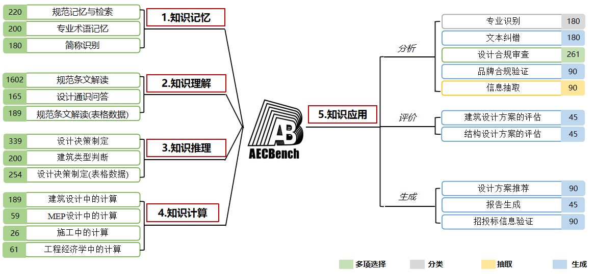

# 🏗️ AECBench 


<p align="center">
  
</p>

<div align="center">

[](https://archiai-lab.github.io/AECBench.github.io/)  [](https://arxiv.org/pdf/2509.18776)   [](https://huggingface.co/datasets/jackluoluo/AECBench)  [](README.md)
</div>

---

## 项目介绍

**AECBench** 是由华建集团华东建筑设计研究院有限公司（ECADI）和同济大学联合发布的一款开源大型语言模型建筑、工程与施工（AEC）领域测评基准。该数据集旨在系统评估大语言模型（LLMs）在建筑、工程、施工领域的知识掌握、理解、推理、计算与应用能力，是目前首个覆盖AEC全生命周期、认知层次最全面的中文测评基准。

AECBench基于真实工程业务场景，由跨学科工程师团队设计并经双轮专家审核，确保数据的**真实性、专业性与高质量**。同时，AECBench引入“LLM-as-a-Judge”自动评测机制，实现开放式长文本任务的可扩展评估。

更多信息请访问我们的<a href="https://archiai-lab.github.io/AECBench.github.io/" style="text-decoration: underline;">项目主页</a>。


## 核心优势

• **分层认知框架**：首创AEC领域五级认知评估体系——包括知识记忆、知识理解、知识推理、知识计算与知识应用五个层次。

• **高质量数据集**：由工程师基于规范、内部文档及注册考试题精心编制，包含4800道题目，覆盖23个真实任务类型，涵盖选择、分类、抽取与生成多种任务形式。

• **自动化评估机制**：引入“LLM-as-a-Judge”自动评审机制，依据专家评分量表自动对开放式任务进行评估，大幅提升测评一致性与可扩展性。

• **真实行业场景**：题目源自建筑规范、设计计算、施工管理及设备选型等真实工程流程，确保任务真实性与行业相关性。

## 数据集内容

AECBench包含 **5个认知层级**、**23个评测任务**，共计约4800条样本。

<div align = center>
    
</div>

<table class="tg">
<thead>
  <tr>
    <th class="tg-0pky">认知水平</th>
    <th class="tg-0pky">ID</th>
    <th class="tg-0pky">任务</th>
    <th class="tg-0pky">描述</th>
    <th class="tg-0pky">指标</th>
    <th class="tg-0pky">类型</th>
  </tr>
</thead>
<tbody>
  <tr>
    <td class="tg-lboi" rowspan="3"><b>建筑知识记忆</b></td>
    <td class="tg-qdov">1-1</td>
    <td class="tg-qdov">规范记忆</td>
    <td class="tg-qdov">识别并判断建筑规范条文的正确性与适用性。</td>
    <td class="tg-qdov">Accuracy</td>
    <td class="tg-qdov">单选</td>
  </tr>
  <tr>
    <td class="tg-0pky">1-2</td>
    <td class="tg-qdov">专业术语</td>
    <td class="tg-qdov">根据定义选择正确术语。</td>
    <td class="tg-0pky">Accuracy</td>
    <td class="tg-0pky">单选</td>
  </tr>
  <tr>
    <td class="tg-0pky">1-3</td>
    <td class="tg-qdov">简称识别</td>
    <td class="tg-qdov">识别AEC领域常见缩略语含义。</td>
    <td class="tg-0pky">Accuracy</td>
    <td class="tg-0pky">单选</td>
  </tr>

  <tr>
    <td class="tg-lboi" rowspan="3"><b>知识理解</b></td>
    <td class="tg-0pky">2-1</td>
    <td class="tg-0pky">规范条文理解</td>
    <td class="tg-qdov">理解建筑规范的定性或定量要求。</td>
    <td class="tg-0pky">Accuracy</td>
    <td class="tg-0pky">单选</td>
  </tr>
  <tr>
    <td class="tg-0pky">2-2</td>
    <td class="tg-qdov">设计通识问答</td>
    <td class="tg-qdov">补全或判断建筑设计基础知识。</td>
    <td class="tg-0pky">Accuracy</td>
    <td class="tg-0pky">单选</td>
  </tr>
  <tr>
    <td class="tg-0pky">2-3</td>
    <td class="tg-qdov">表格条文理解</td>
    <td class="tg-qdov">理解规范表格内容及参数逻辑。</td>
    <td class="tg-0pky">Accuracy</td>
    <td class="tg-0pky">单选</td>
  </tr>

  <tr>
    <td class="tg-lboi" rowspan="3"><b>知识推理</b></td>
    <td class="tg-0pky">3-1</td>
    <td class="tg-qdov">设计决策制定</td>
    <td class="tg-qdov">根据场景描述进行规范化设计推理。</td>
    <td class="tg-0pky">Accuracy</td>
    <td class="tg-0pky">单选</td>
  </tr>
  <tr>
    <td class="tg-0pky">3-2</td>
    <td class="tg-qdov">建筑类型推断</td>
    <td class="tg-qdov">从描述中推断建筑类型。</td>
    <td class="tg-0pky">Accuracy</td>
    <td class="tg-0pky">单选</td>
  </tr>
  <tr>
    <td class="tg-0pky">3-3</td>
    <td class="tg-qdov">表格化设计推理</td>
    <td class="tg-qdov">基于规范表格信息进行推理与判断。</td>
    <td class="tg-0pky">Accuracy</td>
    <td class="tg-0pky">单选</td>
  </tr>

  <tr>
    <td class="tg-lboi" rowspan="4"><b>知识计算</b></td>
    <td class="tg-0pky">4-1</td>
    <td class="tg-qdov">建筑设计计算</td>
    <td class="tg-qdov">执行结构与建筑相关计算任务。</td>
    <td class="tg-0pky">Accuracy</td>
    <td class="tg-0pky">单选</td>
  </tr>
  <tr>
    <td class="tg-0pky">4-2</td>
    <td class="tg-qdov">机电设计计算</td>
    <td class="tg-qdov">评估暖通与电气系统计算能力。</td>
    <td class="tg-0pky">Accuracy</td>
    <td class="tg-0pky">单选</td>
  </tr>
  <tr>
    <td class="tg-0pky">4-3</td>
    <td class="tg-qdov">施工管理计算</td>
    <td class="tg-qdov">计算工期、人员与设备等施工参数。</td>
    <td class="tg-0pky">Accuracy</td>
    <td class="tg-0pky">单选</td>
  </tr>
  <tr>
    <td class="tg-0pky">4-4</td>
    <td class="tg-qdov">工程经济计算</td>
    <td class="tg-qdov">进行成本、利率与NPV等经济分析。</td>
    <td class="tg-0pky">Accuracy</td>
    <td class="tg-0pky">单选</td>
  </tr>

  <tr>
    <td class="tg-lboi" rowspan="10"><b>知识应用</b></td>
    <td class="tg-0pky">5-1-1</td>
    <td class="tg-qdov">文档分类</td>
    <td class="tg-qdov">判定建筑文档所属专业类别。</td>
    <td class="tg-0pky">F1</td>
    <td class="tg-0pky">分类</td>
  </tr>
  <tr>
    <td class="tg-0pky">5-1-2</td>
    <td class="tg-qdov">文本校对</td>
    <td class="tg-qdov">纠正文档中的语法与语义错误。</td>
    <td class="tg-0pky">F0.5</td>
    <td class="tg-0pky">生成</td>
  </tr>
  <tr>
    <td class="tg-0pky">5-1-3</td>
    <td class="tg-qdov">合规性检查</td>
    <td class="tg-qdov">验证设计参数是否符合规范要求。</td>
    <td class="tg-0pky">Accuracy</td>
    <td class="tg-0pky">单选</td>
  </tr>
  <tr>
    <td class="tg-0pky">5-1-4</td>
    <td class="tg-qdov">品牌一致性核验</td>
    <td class="tg-qdov">检查设备规格与品牌是否匹配。</td>
    <td class="tg-0pky">soft-F1</td>
    <td class="tg-0pky">抽取</td>
  </tr>
  <tr>
    <td class="tg-0pky">5-1-5</td>
    <td class="tg-qdov">信息抽取</td>
    <td class="tg-qdov">从长文本中抽取项目或招标实体信息。</td>
    <td class="tg-0pky">soft-F1</td>
    <td class="tg-0pky">抽取</td>
  </tr>
  <tr>
    <td class="tg-0pky">5-2-1</td>
    <td class="tg-qdov">建筑设计报告评估</td>
    <td class="tg-qdov">根据专家量表对建筑方案报告进行评分。</td>
    <td class="tg-0pky">Kendall τ</td>
    <td class="tg-0pky">生成</td>
  </tr>
  <tr>
    <td class="tg-0pky">5-2-2</td>
    <td class="tg-qdov">结构设计报告评估</td>
    <td class="tg-qdov">根据量表对结构设计报告进行评分。</td>
    <td class="tg-0pky">Kendall τ</td>
    <td class="tg-0pky">生成</td>
  </tr>
  <tr>
    <td class="tg-0pky">5-3-1</td>
    <td class="tg-qdov">概念方案生成</td>
    <td class="tg-qdov">生成符合规范的建筑概念设计方案。</td>
    <td class="tg-0pky">专家评分</td>
    <td class="tg-0pky">生成</td>
  </tr>
  <tr>
    <td class="tg-0pky">5-3-2</td>
    <td class="tg-qdov">专项报告生成</td>
    <td class="tg-qdov">生成符合行业规范的专项设计报告。</td>
    <td class="tg-0pky">专家评分</td>
    <td class="tg-0pky">生成</td>
  </tr>
  <tr>
    <td class="tg-0lax">5-3-3</td>
    <td class="tg-0lax">投标评审报告生成</td>
    <td class="tg-qdov">根据设备规格与参数生成评审报告。</td>
    <td class="tg-0lax">专家评分</td>
    <td class="tg-0lax">生成</td>
  </tr>
</tbody>
</table>


## 数据格式示例

```json
[
  {
    "instruction": "请你运用建筑知识从A,B,C,D中选出一个正确的答案，并写在[正确答案]和<eoa>之间。例如[正确答案]A<eoa>。请你严格按照这个格式回答。\n请你回答：",
    "question": "下列哪个术语的释义是：“地面坡度不大于1 : 20 且不设扶手的出入口”？\nA.渐变坡道\nB.坡道出入口\nC.无障碍通道\nD.平坡出入口\n\n",
    "answer": "[正确答案]D<eoa>"
  },
]
```

## 使用指南
1.**数据集下载**：请点击[AECBench](https://github.com/ArchiAI-LAB/AECBench)下载数据集。

2.**模型评估**：我们提供基于[OpenCompass](https://github.com/jack-luoluo/AECBench)的模型评估方案，实施步骤如下所示：
 - 首先，完成opencompass的安装过程后，将AECBench->data文件夹数据内容解压放入{PATH_TO_OPENCOMPASS}/AAECBench/处；
 - 其次把数据集测试代码AECBenchData文件夹放入/OpenCompass/configs/datasets/AECBenchData处；
 - 最后，把评估代码AECData.py 放入/OpenCompass/opencompass/datasets/AECData.py 处。
 - AECBench测评数据集代码运行：
```
python run.py --models {your-model} --datasets AECBenchData_gen
```

3.**评估指标**：我们提供了适用于本数据集的评估指标代码并内嵌至opencompass中，可在/OpenCompass/opencompass/datasets/AECData.py中查看使用。


## 测评结果

我们测试了多个开源与商用模型（DeepSeek-R1、GPT-4o、Qwen、GLM-4等）。 

<div align = center>
    
</div>

## 许可证（License）

本项目遵循 [CC BY-NC License](LICENSE) 授权，仅限非商业研究使用。


## 致谢

本项目感谢华建集团华东建筑设计研究院有限公司和同济大学对本项目的大力支持，感谢上海人工智能实验室提供的OpenCompass测评框架，也感谢所有参与数据编制、审核与实验的工程师和研究人员。


## 📚 引用方式

```bibtex
@article{liang2025aecbench,
  title={AECBench: A Hierarchical Benchmark for Knowledge Evaluation of Large Language Models in the AEC Field},
  author={Chen Liang and Zhaoqi Huang and Haofen Wang and Fu Chai and Chunying Yu and Huanhuan Wei and Zhengjie Liu and Yanpeng Li and Hongjun Wang and Ruifeng Luo and Xianzhong Zhao},
  journal={arXiv preprint arXiv:2509.18776},
  year={2025}
}
```

