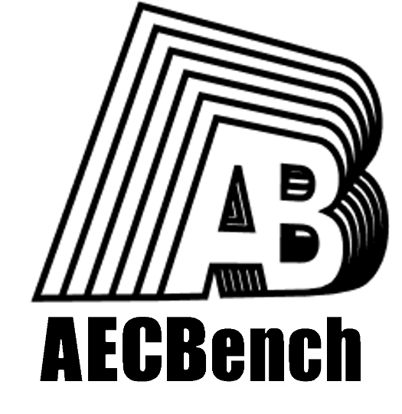

# 🏗️ AECBench 


<p align="center">
  
</p>

<div align="center">

[](https://archiai-lab.github.io/AECBench.github.io/)  [](https://arxiv.org/pdf/2509.18776)   [](https://huggingface.co/datasets/jackluoluo/AECBench)  [](README.md)
</div>

---

## 项目介绍

**AECBench** 是由华建集团华东建筑设计研究院有限公司（ECADI）和同济大学联合发布的一款开源大型语言模型建筑、工程与施工（AEC）领域测评基准。该数据集旨在系统评估大语言模型（LLMs）在建筑、工程、施工领域的知识掌握、理解、推理、计算与应用能力，是目前首个覆盖AEC全生命周期、认知层次最全面的中文测评基准。

AECBench基于真实工程业务场景，由跨学科工程师团队设计并经双轮专家审核，确保数据的**真实性、专业性与高质量**。同时，AECBench引入“LLM-as-a-Judge”自动评测机制，实现开放式长文本任务的可扩展评估。

更多信息请访问我们的<a href="https://archiai-lab.github.io/AECBench.github.io/" style="text-decoration: underline;">项目主页</a>。


## 核心优势

• **分层认知框架**：首创AEC领域五级认知评估体系——包括知识记忆、知识理解、知识推理、知识计算与知识应用五个层次。

• **高质量数据集**：由工程师基于规范、内部文档及注册考试题精心编制，包含4800道题目，覆盖23个真实任务类型，涵盖选择、分类、抽取与生成多种任务形式。

• **自动化评估机制**：引入“LLM-as-a-Judge”自动评审机制，依据专家评分量表自动对开放式任务进行评估，大幅提升测评一致性与可扩展性。

• **真实行业场景**：题目源自建筑规范、设计计算、施工管理及设备选型等真实工程流程，确保任务真实性与行业相关性。

## 数据集内容

AECBench包含 **5个认知层级**、**23个评测任务**，共计约4800条样本。

<div align = center>
    
</div>

<table class="tg">
<thead>
  <tr>
    <th class="tg-0pky">认知水平</th>
    <th class="tg-0pky">ID</th>
    <th class="tg-0pky">任务</th>
    <th class="tg-0pky">描述</th>
    <th class="tg-0pky">指标</th>
    <th class="tg-0pky">类型</th>
  </tr>
</thead>
<tbody>
  <tr>
    <td class="tg-lboi" rowspan="3"><b>建筑知识记忆</b></td>
    <td class="tg-qdov">1-1</td>
    <td class="tg-qdov">规范记忆</td>
    <td class="tg-qdov">给定规范条文原文，四选一识别所属规范/条款来源。</td>
    <td class="tg-qdov">Accuracy</td>
    <td class="tg-qdov">单选</td>
  </tr>
  <tr>
    <td class="tg-0pky">1-2</td>
    <td class="tg-qdov">专业术语</td>
    <td class="tg-qdov">给定术语定义，四选一选择正确术语。</td>
    <td class="tg-0pky">Accuracy</td>
    <td class="tg-0pky">单选</td>
  </tr>
  <tr>
    <td class="tg-0pky">1-3</td>
    <td class="tg-qdov">简称识别</td>
    <td class="tg-qdov">给定缩略语，四选一选择其正确全称。</td>
    <td class="tg-0pky">Accuracy</td>
    <td class="tg-0pky">单选</td>
  </tr>

  <tr>
    <td class="tg-lboi" rowspan="3"><b>知识理解</b></td>
    <td class="tg-0pky">2-1</td>
    <td class="tg-0pky">规范条文解读</td>
    <td class="tg-qdov">给定改写/部分描述的规范要求，理解定性或定量要求并四选一作答。</td>
    <td class="tg-0pky">Accuracy</td>
    <td class="tg-0pky">单选</td>
  </tr>
  <tr>
    <td class="tg-0pky">2-2</td>
    <td class="tg-qdov">设计通识问答</td>
    <td class="tg-qdov">给定不完整的设计通识表述，推断缺失核心概念并四选一作答。</td>
    <td class="tg-0pky">Accuracy</td>
    <td class="tg-0pky">单选</td>
  </tr>
  <tr>
    <td class="tg-0pky">2-3</td>
    <td class="tg-qdov">规范条文解读（表格数据）</td>
    <td class="tg-qdov">给定规范表格相关描述，理解表格要求并四选一作答。</td>
    <td class="tg-0pky">Accuracy</td>
    <td class="tg-0pky">单选</td>
  </tr>

  <tr>
    <td class="tg-lboi" rowspan="3"><b>知识推理</b></td>
    <td class="tg-0pky">3-1</td>
    <td class="tg-qdov">设计决策制定</td>
    <td class="tg-qdov">基于项目场景进行规范推理，选择合规且逻辑一致的措施/决策。</td>
    <td class="tg-0pky">Accuracy</td>
    <td class="tg-0pky">单选</td>
  </tr>
  <tr>
    <td class="tg-0pky">3-2</td>
    <td class="tg-qdov">建筑类型判断</td>
    <td class="tg-qdov">根据建筑描述进行归纳判断建筑类型。</td>
    <td class="tg-0pky">Accuracy</td>
    <td class="tg-0pky">单选</td>
  </tr>
  <tr>
    <td class="tg-0pky">3-3</td>
    <td class="tg-qdov">设计决策制定（表格数据）</td>
    <td class="tg-qdov">参考规范表格信息进行设计决策推理。</td>
    <td class="tg-0pky">Accuracy</td>
    <td class="tg-0pky">单选</td>
  </tr>

  <tr>
    <td class="tg-lboi" rowspan="4"><b>知识计算</b></td>
    <td class="tg-0pky">4-1</td>
    <td class="tg-qdov">建筑设计中的计算</td>
    <td class="tg-qdov">建筑/结构设计定量题计算，四选一确定正确结果。</td>
    <td class="tg-0pky">Accuracy</td>
    <td class="tg-0pky">单选</td>
  </tr>
  <tr>
    <td class="tg-0pky">4-2</td>
    <td class="tg-qdov">MEP设计中的计算</td>
    <td class="tg-qdov">机电（MEP）设计定量计算题，四选一确定正确结果。</td>
    <td class="tg-0pky">Accuracy</td>
    <td class="tg-0pky">单选</td>
  </tr>
  <tr>
    <td class="tg-0pky">4-3</td>
    <td class="tg-qdov">施工中的计算</td>
    <td class="tg-qdov">施工阶段工期、人员与设备等参数计算，四选一确定结果。</td>
    <td class="tg-0pky">Accuracy</td>
    <td class="tg-0pky">单选</td>
  </tr>
  <tr>
    <td class="tg-0pky">4-4</td>
    <td class="tg-qdov">工程经济学中的计算</td>
    <td class="tg-qdov">工程经济学计算（利率、NPV等），四选一确定结果。</td>
    <td class="tg-0pky">Accuracy</td>
    <td class="tg-0pky">单选</td>
  </tr>

  <tr>
    <td class="tg-lboi" rowspan="10"><b>知识应用</b></td>
    <td class="tg-0pky">5-1-1</td>
    <td class="tg-qdov">专业识别</td>
    <td class="tg-qdov">给定文档句子，判定其所属专业类别。</td>
    <td class="tg-0pky">F1</td>
    <td class="tg-0pky">分类</td>
  </tr>
  <tr>
    <td class="tg-0pky">5-1-2</td>
    <td class="tg-qdov">文本纠错</td>
    <td class="tg-qdov">识别并纠正拼写、冗余、遗漏、语序与语义错误。</td>
    <td class="tg-0pky">F0.5</td>
    <td class="tg-0pky">生成</td>
  </tr>
  <tr>
    <td class="tg-0pky">5-1-3</td>
    <td class="tg-qdov">合规审查</td>
    <td class="tg-qdov">分析多参数设计案例是否合规，不合规则选出具体违规原因。</td>
    <td class="tg-0pky">Accuracy</td>
    <td class="tg-0pky">单选</td>
  </tr>
  <tr>
    <td class="tg-0pky">5-1-4</td>
    <td class="tg-qdov">品牌合规验证</td>
    <td class="tg-qdov">从设备规格表中识别品牌相关偏差并报告。</td>
    <td class="tg-0pky">soft-F1</td>
    <td class="tg-0pky">抽取</td>
  </tr>
  <tr>
    <td class="tg-0pky">5-1-5</td>
    <td class="tg-qdov">信息抽取</td>
    <td class="tg-qdov">从长文档中抽取预定义类型的实体信息。</td>
    <td class="tg-0pky">soft-F1</td>
    <td class="tg-0pky">抽取</td>
  </tr>
  <tr>
    <td class="tg-0pky">5-2-1</td>
    <td class="tg-qdov">建筑设计方案的评估</td>
    <td class="tg-qdov">作为评审者按量表对建筑方案报告评分（准确性、专业表达、可读性、格式）。</td>
    <td class="tg-0pky">Kendall τ</td>
    <td class="tg-0pky">生成</td>
  </tr>
  <tr>
    <td class="tg-0pky">5-2-2</td>
    <td class="tg-qdov">结构设计方案的评估</td>
    <td class="tg-qdov">按量表对结构设计报告评分。</td>
    <td class="tg-0pky">Kendall τ</td>
    <td class="tg-0pky">生成</td>
  </tr>
  <tr>
    <td class="tg-0pky">5-3-1</td>
    <td class="tg-qdov">设计方案推荐</td>
    <td class="tg-qdov">根据项目简报与要求生成概念设计方案。</td>
    <td class="tg-0pky">基于大语言模型的自动评审</td>
    <td class="tg-0pky">生成</td>
  </tr>
  <tr>
    <td class="tg-0pky">5-3-2</td>
    <td class="tg-qdov">报告生成</td>
    <td class="tg-qdov">根据项目简要需求生成符合规范的专项设计报告。</td>
    <td class="tg-0pky">基于大语言模型的自动评审</td>
    <td class="tg-0pky">生成</td>
  </tr>
  <tr>
    <td class="tg-0lax">5-3-3</td>
    <td class="tg-0lax">招投标信息验证</td>
    <td class="tg-qdov">识别参数不符并生成招投标评审报告总结差异。</td>
    <td class="tg-0lax">基于大语言模型的自动评审</td>
    <td class="tg-0lax">生成</td>
  </tr>
</tbody>
</table>


## 数据格式示例

```json
[
  {
    "instruction": "请你运用建筑知识从A,B,C,D中选出一个正确的答案，并写在[正确答案]和<eoa>之间。例如[正确答案]A<eoa>。请你严格按照这个格式回答。\n请你回答：",
    "question": "下列哪个术语的释义是：“地面坡度不大于1 : 20 且不设扶手的出入口”？\nA.渐变坡道\nB.坡道出入口\nC.无障碍通道\nD.平坡出入口\n\n",
    "answer": "[正确答案]D<eoa>"
  },
]
```

## 使用指南
1.**数据集下载**：请点击[AECBench](https://github.com/ArchiAI-LAB/AECBench)下载数据集。

2.**模型评估**：我们提供基于[OpenCompass](https://github.com/open-compass/opencompass)的模型评估方案，实施步骤如下所示：

 - 安装 OpenCompass 后，将 AECBench 的 `one-shot` 数据（位于 `./data/one-shot/`）放入 `{PATH_TO_OPENCOMPASS}/AECBench/one-shot/`；
 - 将数据集配置文件夹 `AECBenchData` 放入 `{PATH_TO_OPENCOMPASS}/opencompass/configs/datasets/`；
 - 将评估代码 `AECData.py` 放入 `{PATH_TO_OPENCOMPASS}/opencompass/datasets/`；
 - 在 `{PATH_TO_OPENCOMPASS}/opencompass/datasets/__init__.py` 中加入一行：`from .AECData import *`；
 - 运行命令：
```
python run.py --models {your-model} --datasets AECBenchData_gen
```

**任务启用说明**：`AECBenchData_gen.py` 中的 `*_sets` 列表决定实际运行的子任务。默认只会运行非空列表中的任务；如需全量评测，请将各任务名称加入对应列表。

**推荐目录结构（OpenCompass 根目录）**：
```
{PATH_TO_OPENCOMPASS}/
├── AECBench/
│   └── one-shot/
│       ├── 1-1规范记忆.json
│       ├── 1-2专业术语.json
│       ├── ...
├── opencompass/
│   ├── configs/
│   │   └── datasets/
│   │       └── AECBenchData/
│   │           └── AECBenchData_gen.py
│   └── datasets/
│       ├── __init__.py   # 添加: from .AECData import *
│       └── AECData.py
└── run.py
```

3.**评估指标**：我们提供了适用于本数据集的评估指标代码并内嵌至opencompass中，可在/OpenCompass/opencompass/datasets/AECData.py中查看使用。


## 测评结果

我们选取了九种广泛使用的大语言模型进行评测，涵盖开源模型与闭源模型，其中 QwQ-32B、DeepSeek-R1 和 GPT o3-mini 针对推理能力进行了专门优化。


**Table: Evaluation results on AECBench (higher is better).**

| Task ID | Moonshot-v1-128k | GLM-4-Plus | Qwen-Turbo | QwQ-32B | DeepSeek-V3 | DeepSeek-R1 | GPT-4o | GPT-o3-mini | Hunyuan-TurboS |
|:------:|:-----------------:|:----------:|:----------:|:-------:|:-----------:|:-----------:|:------:|:-----------:|:--------------:|
| 1-1    | 67.27             | 73.64      | 70.45      | 69.54   | 83.64       | **87.27**   | 67.27  | 63.64       | 82.73          |
| 1-2    | 96                | 97.5       | **98.5**   | 97      | 98          | 98          | 97.5   | 95          | **98.5**       |
| 1-3    | 71.67             | 80.00      | 67.78      | 77.22   | 83.89       | **87.22**   | 78.33  | 86.11       | 75.00          |
| 2-1    | 55.24             | 67.67      | 73.41      | 67.73   | 78.34       | **84.02**   | 60.05  | 54.06       | 77.03          |
| 2-2    | 71.52             | 85.45      | 87.88      | 88.48   | 88.48       | 89.70       | 80.00  | 70.91       | **90.30**      |
| 2-3    | 43.92             | 34.92      | 43.92      | 40.74   | 52.38       | **63.49**   | 44.44  | 39.68       | 43.92          |
| 3-1    | 53.69             | 66.96      | 74.63      | 71.39   | 75.52       | **82.60**   | 60.77  | 60.47       | 74.63          |
| 3-2    | 85.00             | 85.00      | 76.00      | 83.00   | 90.00       | **91.00**   | 85.50  | 82.50       | 88.00          |
| 3-3    | 34.65             | 35.83      | 43.31      | 42.13   | 32.68       | **53.94**   | 39.76  | 42.91       | 44.49          |
| 4-1    | 35.45             | 47.62      | 41.27      | 43.92   | 57.67       | **78.84**   | 39.68  | 51.32       | 33.86          |
| 4-2    | 34.62             | 73.08      | 69.23      | 88.46   | 88.46       | **96.15**   | 65.38  | 92.31       | 41.53          |
| 4-3    | 44.26             | 81.97      | 65.57      | 83.61   | **86.89**   | 85.25       | 59.02  | 75.41       | 48.08          |
| 4-4    | 35.59             | 54.24      | 50.85      | 25.42   | 55.93       | **66.10**   | 50.85  | 44.07       | 67.21          |
| 5-1-1  | 85.28             | 85.56      | 77.22      | 76.96   | 86.94       | 87.78       | **89.72** | 87.22    | 85.00          |
| 5-1-2  | 92.23             | **93.24**  | 93.75      | 86.12   | 90.19       | 62.73       | 93.14  | 89.51       | 81.20          |
| 5-1-3  | 32.95             | 7.66       | 38.70      | 45.21   | 34.87       | **52.49**   | 42.91  | 48.66       | 45.21          |
| 5-1-4  | 26.90             | 30.38      | 28.45      | 18.80   | 30.66       | 29.73       | 31.09  | 29.95       | **37.00**      |
| 5-1-5  | **73.21**         | 64.15      | 67.35      | 44.10   | 73.10       | 70.48       | 68.43  | 69.12       | 73.10          |
| 5-2-1  | 48.4              | 47.1       | 47.4       | 38.3    | 45.2        | **53.2**    | 46.5   | 50.5        | 54.9           |
| 5-2-2  | 30.9              | 33.9       | 41.7       | 51.1    | 55.7        | **56.4**    | 34.2   | 46.6        | 49.6           |
| 5-3-1  | 19.83             | 25.67      | 24.11      | 32.67   | 36.33       | **50.28***  | 19.33  | 29.11       | 43.94          |
| 5-3-2  | 27.78             | 36.67      | 33.33      | 30.00   | 39.56       | **44.44***  | 24.22  | 15.56       | 40.00          |
| 5-3-3  | 39.44             | 49.17      | 33.61      | 52.78   | 49.17       | 51.11*      | 44.44  | **53.33**   | 42.78          |


\* 任务 5-3-1、5-3-2 和 5-3-3 使用 DeepSeek-R1 作为评审模型；标记 `*` 的分数表示可能存在评估偏差。所有指标已归一化至 0-100 范围；Kendall's τ 值已乘以 100。加粗数字表示该任务的最佳性能。

## 许可证（License）

本项目遵循 [CC BY-NC License](LICENSE) 授权，仅限非商业研究使用。


## 致谢

本项目感谢华建集团华东建筑设计研究院有限公司和同济大学对本项目的大力支持，感谢上海人工智能实验室提供的OpenCompass测评框架，也感谢所有参与数据编制、审核与实验的工程师和研究人员。


## 📚 引用方式

```bibtex
@article{LIANG2026104314,
title = {AECBench: A hierarchical benchmark for knowledge evaluation of large language models in the AEC field},
journal = {Advanced Engineering Informatics},
volume = {71},
pages = {104314},
year = {2026},
issn = {1474-0346},
doi = {https://doi.org/10.1016/j.aei.2026.104314},
url = {https://www.sciencedirect.com/science/article/pii/S1474034626000066},
author = {Chen Liang and Zhaoqi Huang and Haofen Wang and Fu Chai and Chunying Yu and Huanhuan Wei and Zhengjie Liu and Yanpeng Li and Hongjun Wang and Ruifeng Luo and Xianzhong Zhao},
}
```
